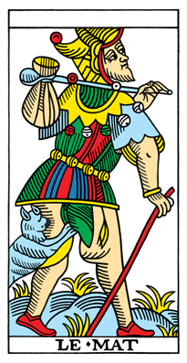
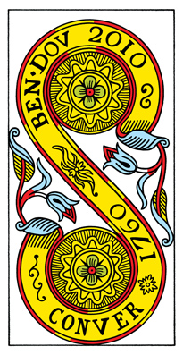
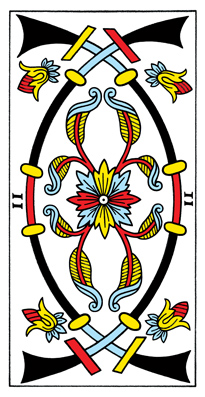
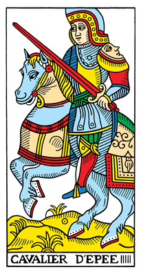
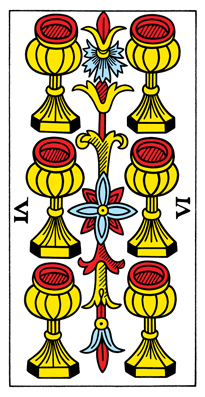
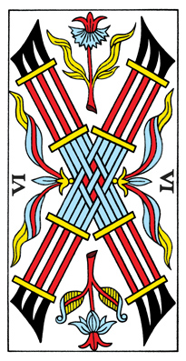

This course is for anyone who is interested in reading tarot cards, or even just playing with them. The tarot is a valuable tool for thinking, brainstorming, inspiration and insight. It can also be a method, a meditation or a ritual.

Learning how to read the cards takes time and practice. There are several different methods and schools of thought when it comes to tarot. With agnostic tarot we are starting at the most basic element, numbers or ranks.

What I have done is assigned a keyword, one word to each rank. This is the starting point for reading. The word is not negative or positive - just a neutral word. These words are based on numerology.

Once you have your keyword, there are different ways you can expand your story. This guide will show you some of these ways.

Also, the meanings I use for the tarot are all down to earth, real life examples. I have purposely avoided religious, spiritual, new age or psychology associations. In this guide, tarot is a tool for day to day life. There is no magic, there is no power, there is no ritual, and no spirits either. This is about getting real life, hands on experience with the cards. In time the meanings of the cards will grow to resonate with you.

I think it is a barrier, at least for beginners, to attach a bunch of mystical, magical, religious and psychological meanings to the cards.  It makes an obstacle for the reader. It adds mental and emotional noise that isn't helpful. And you don't need any of those things to use the tarot to good effect.

There is nothing wrong with the beliefs and practices of other readers. They are helpful and can enhance the experience. I am simply trying to break down barriers to entry so more people can enjoy reading tarot cards and use them to solve every day problems. In time you will find your own practices with the card.

The keywords are like the first brush stroke on a blank canvas. A blank page can block your thinking. But once you start, even just one step, the blockage is removed.

In time, after using the cards over and over again they will hold lots of meaning for you. But the keywords will always be there to get you started if you want to use them.

## Links