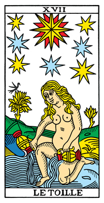
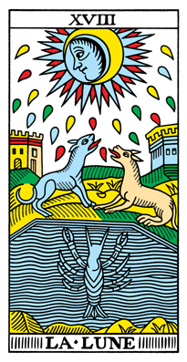
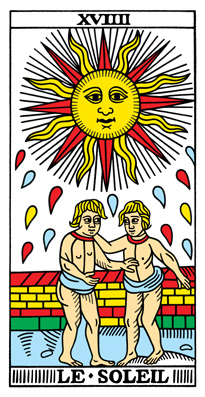
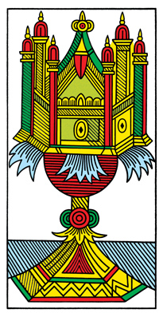
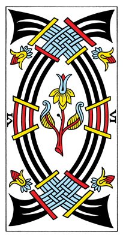
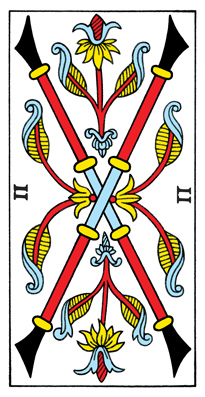
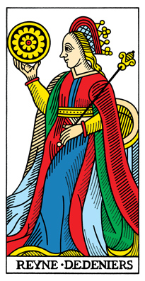
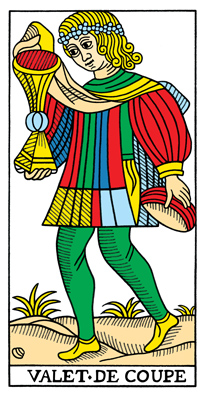
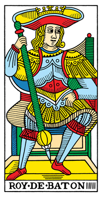

The first step is learning the cards. I mean the tarot structure and it's meaning. A tarot deck is made up of 78 cards as follows:

- 22 major arcana
- 40 pips
- 16 court cards

I also want to note that this course is strictly non-religious, non-spiritual, non-archetypal, etc etc. The cards are mundane in this course. There is no ne need to do anything special for this course. 

## Major Arcana

The major arcana contain scenes, characters and symbols. They are typically considered more significant in a reading. They allude to classic themes of life, love, work, death, money etc. They follow a story from I - XXI, a road traveled by le Mat(0).

For the purpose of this course we are assigning a keyword to each major arcana. Our focus of study is going to be the minors. The keywords will be accurate and fitting but just a simple seed. Once you have mastered the practice, you can do a deep dive on the majors if you want. And remember that the more you read (_the cards_), the more you will find meanings that resonate with you, in all of the cards.

## Pips

The pips are the number cards, ace through ten. There are more pips than court cards and majors combined. These are the cards of daily life and the cycles of life. The pips will be our main focus in this course.

The keywords are assigned based on their rank, ace through ten. That is where we start, and we can expand from there until we are done.

## Court Cards

The court cards are valets, cavaliers, queens and kings. There is some extra nuance in the courts because each card has a person on it as the main focus. You can read them many different ways, but in this course they will be assigned a keyword based on their rank, eleven through fourteen.

The other characteristics of the cards will be used to expand the meanings as desired.

### Why Keywords?

The reason we are focusing on keywords, is that they are enough to get started. Once we start, then it is easier to continue. But coming in blank is much more challenging. It is like a blank page, harder to overcome than paragraphs of gibberish. You need something to work with, and the keyword is that.

Also once you have the core ideas memorized, then you can apply that basic knowledge to any deck you come across. 

Most importantly this method allows you to handle the cards, to 

